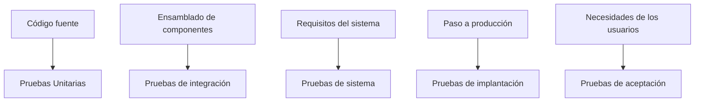
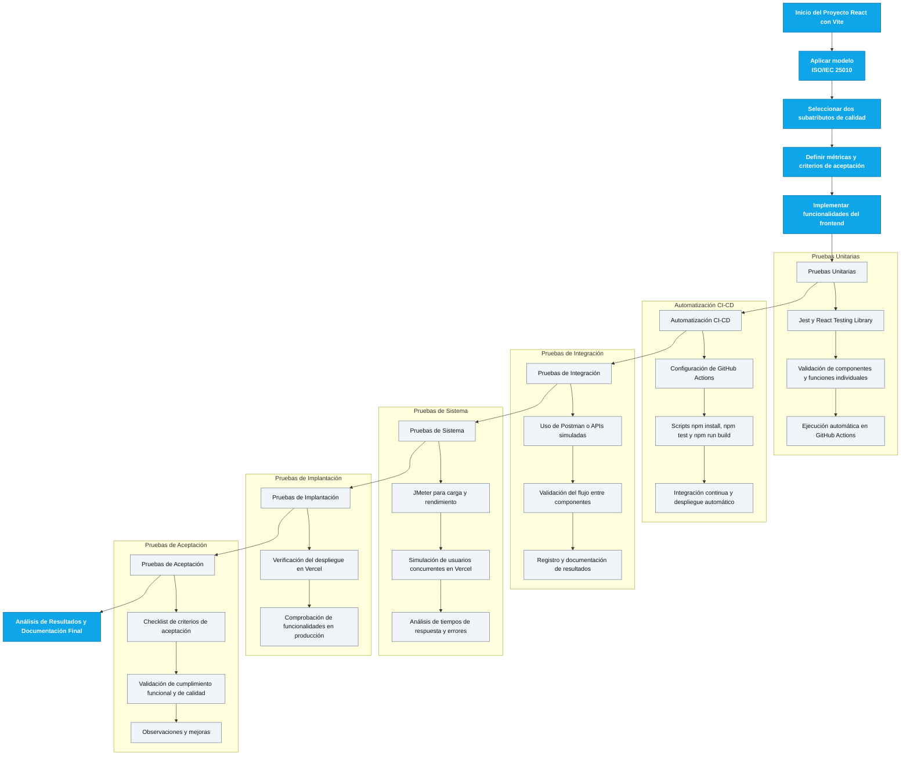

# Actividad Final Integrada (Momento 3)

## Asignatura: Calidad de Software
#### 1. Objetivo General
Aplicar integralmente los conceptos de calidad de software en un proyecto real desarrollado en React, a través de la ejecución de pruebas de calidad, automatización de integración continua, despliegue en la nube y documentación de un plan de aseguramiento de calidad basado en normas internacionales.

#### 2. Descripción General del Trabajo
Cada grupo trabajará sobre el mismo repositorio base de React: 
https://github.com/guswill24/integracion_continua.git

El repositorio provisto es un frontend construido con Vite + React. No incluye backend propio. Las pruebas de integración se enfocarán en integración de componentes/flujo de navegación y, cuando aplique, en simulación de peticiones HTTP. A continuación se detallan los puntos que se deben aplicar:
- Aplicación del modelo de calidad ISO/IEC 25010 en el uso de 2 subatributos de una característica de las 8 totales.
- Del contexto del proyecto: Colegio Mentes Creativas que busca implementar una aplicación multimedia que apoye los procesos de enseñanza-aprendizaje de los estudiantes de 4° y 5° grado en áreas clave del currículo: matemáticas, ciencias naturales, ciencias sociales, tecnología, pensamiento lógico y arte. Cumplir con el objetivo "Incorporar recursos multimedia (audio, video, gráficos 3D) que favorezcan el aprendizaje lúdico" link de referencia: https://asigcalidadsoftware.vercel.app/modules/docbase y de igual forma en el desarrollo de 3 temas de las áreas temáticas solicitadas.
- Genere los requerimientos funcionales de los 3 temas que se deben desarrollar ajustados al link de referencia : https://asigcalidadsoftware.vercel.app/modules/levrequi
- Ajuste la interfaz del aplicativo dejando presente en el menu, solo las opciones que hacen parte de este proyecto.
- Ejecución de pruebas unitarias, de integración, de sistema, de implantación y de aceptación.
- Automatización del flujo de integración continua usando GitHub Actions
- Despliegue del frontend en Vercel.
- Documentación técnica detallada de todo el proceso.

**Límite de integrantes por grupo: 3 personas.**

**Clonar proyecto**
```bash
git clone https://github.com/guswill24/integracion_continua.git
```

#### 3. Stack técnico del proyecto (actual)
- React 19 + Vite 7 (frontend)
- TypeScript 5.8, ESLint 9, Prettier 3, TailwindCSS 4
- Pruebas: Jest 30 + jest-environment-jsdom, React Testing Library 16
- Node.js >= 18.18
- Scripts: npm test, npm run build, npm run dev, npm run lint, npm run type-check

#### 4. Tipos de Pruebas de Software a Desarrollar



**Descripción de cada tipo de prueba:**
- Pruebas Unitarias: Validación de funciones y clases aisladas mediante Jest, ejecutadas a través de github actions.
Fuente: https://asigcalidadsoftware.vercel.app/modules/test_jest
- Pruebas de Integración: Validación de interacción con endpoints. Si el equipo consume APIs públicas, estas se pueden complementar con Postman.[Este apartado lo completaremos el día 29 de noviembre]
- Pruebas de Sistema: Validación de tiempos de respuesta y comportamiento bajo carga del sitio desplegado en Vercel usando JMeter.
Fuente: https://asigcalidadsoftware.vercel.app/modules/jmeter_1
- Pruebas de Implantación: Validación de despliegue correcto del frontend en Vercel.
- Pruebas de Aceptación: Validación del cumplimiento de funcionalidades básicas mediante checklist de criterios.

#### 5. Actividades a Realizar
**5.1 Aseguramiento de Calidad**
- Aplicar el modelo ISO/IEC 25010 al escenario asignado.
- Definir 2 subatributos de calidad basados en una característica de la ISO/IEC 25010 para el propósito del proyecto.

**5.2 Pruebas Unitarias**
- Implementar pruebas unitarias usando Jest sobre los requerimientos desarrollados.

**5.3 Automatización de Integración Continua (CI/CD)**
- Configurar GitHub Actions que ejecute:
  - npm install
  - npm test (pruebas unitarias)
  - npm run build (construcción del proyecto)
- Evidenciar la ejecución automática de los procesos en Github.
Fuente: https://asigcalidadsoftware.vercel.app/modules/workflow_actions

**5.4 Pruebas de Integración**
- Usar Postman para probar los endpoints:
- Exportar la colección Postman y documentar los resultados.

**5.5 Pruebas de Sistema**
- Utilizar JMeter para simular carga concurrente sobre el sitio publicado en Vercel.
- Analizar y documentar los tiempos de respuesta y tasas de error.

**5.6 Pruebas de Implantación**
- Validar que el sistema esté correctamente desplegado en Vercel.
- Comprobar que las funcionalidades principales estén operativas en el entorno de producción.

**5.7 Pruebas de Aceptación**
- Completar el checklist de criterios de aceptación estandarizado.
- Documentar observaciones y resultados obtenidos.

#### 6. Checklist de Pruebas de Aceptación
|ID|Criterio de Aceptación|Estado (Cumple/No Cumple)|Observaciones|
|-|-|-|-|  
|1|El sitio educativo se despliega correctamente en Vercel sin errores visibles| | |
|2|El proyecto carga en menos de 3 segundos desde Vercel.| | |
|3|Los endpoints devuelven datos correctos.| | |
|6|La navegación o interacción del aplicativo es fluida.| | |
|7|No se presentan errores visibles en consola del navegador.| | |
|8|Las pruebas unitarias pasan correctamente en el pipeline automático.| | |
|9|Las pruebas de integración con Postman son exitosas.| | |
|10|Los resultados de pruebas de carga (JMeter) están dentro de los tiempos aceptables (< 5 segundos promedio de respuesta).| | |

#### 7. Estructura del Documento Final de Entrega

1. Portada
    - Nombre del proyecto
    - Integrantes del grupo (nombres completos)
    - Profesor
    - Programa
    - Ciudad
    - Fecha de entrega
2. Introducción
    - Breve explicación del proyecto base
    - Propósito del documento.
3. Escenario Asignado y Justificación
    - Descripción detallada del escenario de aplicación.
    - Justificación de las necesidades de calidad específicas.
4. Normas y Modelos de Calidad Aplicados
    - Descripción de norma y modelo utilizados (ISO/IEC 25010).
5. Métricas de Calidad Definidas [Esto lo definen los subatributos sobre los que se va a trabajar]
    - Definición de métricas específicas.
    - Método de medición y criterios de aceptación.
6. Proceso de Despliegue en Vercel
    - Pasos realizados para desplegar el proyecto.
    - Evidencias del despliegue (capturas, URL pública).
7. Pruebas Unitarias Implementadas
    - Código de pruebas unitarias.
    - Evidencia de ejecución y resultados.
8. Automatización de CI/CD (github actions)
    - Configuración del workflow.
    - Resultados de ejecución de pruebas y build.
9. Pruebas de Integración con Postman
    - Casos de prueba ejecutados sobre los endpoints REST.
    - Evidencias (capturas de pantallas y resultados).
10. Pruebas de Sistema con JMeter
    - Descripción del diseño de pruebas de carga.
    - Análisis de resultados.
11. Pruebas de Implantación
    - Validación del despliegue final en producción.
    - Evidencias de funcionamiento.
12. Checklist de Aceptación Completado
    - Presentación del checklist llenado por el grupo.
    - Observaciones de cumplimiento o fallos.
13. Análisis de Resultados
    - Reflexión crítica sobre resultados de pruebas.
    - Mejoras propuestas.
14. Conclusiones
    - Aprendizajes principales.
    - Evaluación global de la experiencia.
15. Referencias Bibliográficas
    - Normas, libros, artículos y recursos utilizados.

#### 8. Entregables Obligatorios
- Documento final en formato PDF, siguiendo toda la estructura definida.
- Repositorio en GitHub con:
  - Proyecto React desplegable y funcionando.
  - Código de pruebas unitarias implementadas con Jest.
  - Configuración de Github Actions.
  - Evidencias de pruebas de integración de Postman.
  - Scripts o archivos de JMeter usados en las pruebas de sistema.
- Despliegue en Vercel:
  - Proyecto desplegado correctamente.
  - URL pública activa y funcional.
- Temas a tener presente en la sustentación:
  - Duración 10 minutos.
  - Debe mostrar:
    - Breve presentación del objetivo del trabajo.
    - Resultados de las pruebas unitarias, integración y sistema.
    - Evidencia del pipeline de CI/CD funcionando.
    - Proyecto funcionando en Vercel.

#### 9. Criterios de Evaluación
|Criterio|Ponderación|
|-|-|
|Aplicación de normas/modelos de calidad|15%|
|Diseño y ejecución del plan de pruebas funcionales|15%|
|Implementación de pruebas unitarias con Jest (Est. 1)|15%|
|Configuración correcta de CI/CD con Github Actions (Est. 2)|15%|
|Ejecución de pruebas de integración con Postman (Est. 3)|10%|
|Realización de pruebas de sistema con JMeter (Est. 4)|10%|
|Correcto despliegue en Vercel|10%|
|Calidad de la documentación técnica y sustentación final|10%|

***En la sustentación cada estudiante deberá abordar las pruebas unitarias, Integración Continua CI, Postman y Jmeter.**

**Nota Final Importante**
- La información presentada en el documento, repositorio y sustentación final, debe ser clara, precisa y directamente relacionada con los objetivos y actividades definidas para esta actividad.
- El uso de contenido generado por herramientas de inteligencia artificial (IA) que no sea pertinente, no demuestre comprensión real o no esté adecuadamente adaptado al contexto del proyecto será penalizado en la nota final.
- Durante la sustentación, se evaluará la coherencia entre lo entregado y lo expuesto por el grupo.
- Se restarán puntos si se evidencia desconocimiento del proyecto o del proceso desarrollado.
- La falta de dominio sobre las pruebas realizadas, los entregables o las configuraciones implementadas impactará directamente en la calificación del expositor.
- Cada integrante debe conocer y ser capaz de explicar el contenido de su entrega.

#### 10. Fecha de entrega y sustentación
|Sustentación|Fecha límite de entrega del documento|
|---|---|
|12 de noviembre 2025|11 de noviembre de 2025|

#### 11. Diagrama plan de trabajo
Para revisar el flujo de trabajo lleve este script al sitio https://mermaid.live/



**Mg. Gustavo Sánchez Rodriguez**
Docente Universidad Cooperativa de Colombia